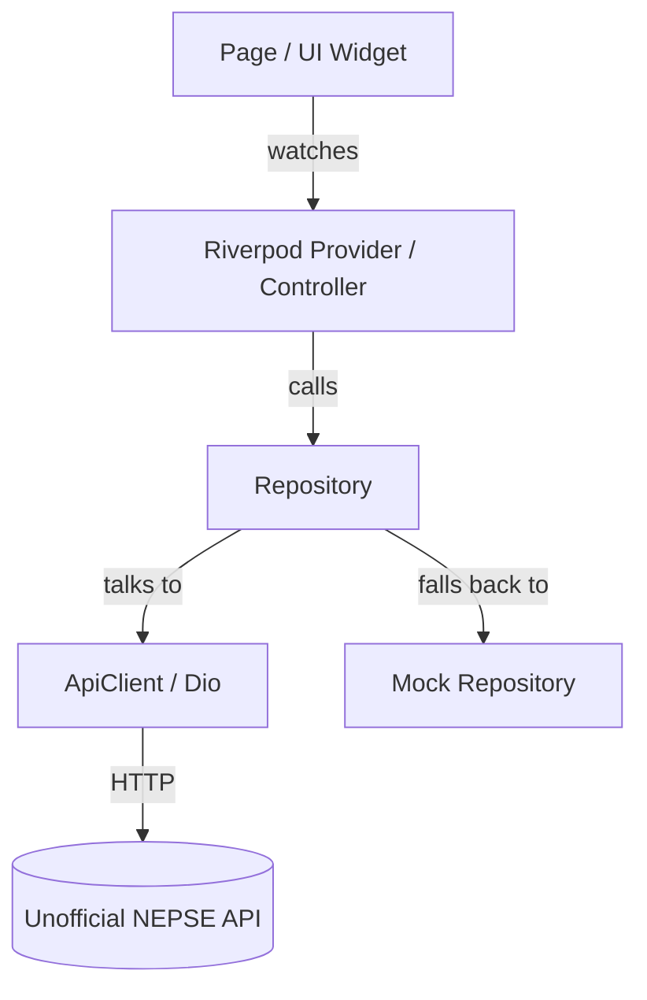

🐂🐻 Bull & Bear
Nepal stock market at a glance — a personal portfolio project built to explore modern Flutter architecture, state management, and real-world API integration challenges.
> ⚠️ Personal/educational project. Not affiliated with the Nepal Stock Exchange (NEPSE) or any brokerage. See [Data Source & Disclaimers](#-data-source--disclaimers) below
<!-- 
  DEMO GIF: save your screen-recording as demo.gif inside a folder called
  docs/ in the project root (create the folder if it doesn't exist), then
  this line will automatically show it once pushed to GitHub.

---
✨ Features
Home Dashboard — live NEPSE index, market summary (turnover, transactions, scrips traded), and today's top gainers/losers
Watchlist — star any stock to track it, saved locally on your device
Market — searchable, sector-filterable directory of listed companies
Portfolio — manually log your holdings and see real-time profit/loss
Light & dark theme — follows system setting or choose manually, remembered across launches
Offline-aware — clearly distinguishes "no internet" from "market data feed unavailable," and never silently mixes real and demo data
Auto-refreshing data — pulls fresh market data every 60 seconds in the background
📸 Screenshots
<!--
  Save each screenshot into docs/screenshots/ with these exact filenames
  and they'll appear automatically once you push:
    docs/screenshots/home.png
    docs/screenshots/watchlist.png
    docs/screenshots/market.png
    docs/screenshots/portfolio.png
    docs/screenshots/more.png
Home	Watchlist	Market
		

Portfolio	More / Settings
	
🏗️ Architecture
Feature-first structure with an MVVM + Repository pattern in each feature:

```
lib/
├── core/                 # Cross-cutting concerns, not tied to one feature
│   ├── api/              # Dio client wrapper
│   ├── network/          # Connectivity awareness
│   ├── router/           # go_router navigation config
│   ├── shell/            # Bottom nav bar shell
│   ├── theme/            # Colors, light/dark ThemeData, theme controller
│   └── widgets/          # Shared widgets (e.g. StockAvatar)
├── features/
│   ├── dashboard/        # Home tab: index, summary, movers
│   ├── watchlist/        # Starred stocks
│   ├── market/           # Company directory + search
│   ├── portfolio/        # Manually tracked holdings + P&L
│   ├── more/             # Settings & about
│   └── splash/           # Launch screen
├── app.dart              # Root MaterialApp.router widget
└── main.dart             # Entry point
```
🧰 Tech Stack
Purpose	Package
State management	flutter_riverpod
Navigation	go_router
Networking	dio
Local persistence	shared_preferences
Typography	google_fonts
Connectivity	connectivity_plus
App icon generation	flutter_launcher_icons
Base state/network abstractions	`base_kit` (self-authored, MIT-licensed)
🚀 Getting Started
```bash
git clone https://github.com/<your-username>/bull-and-bear.git
cd bull-and-bear
flutter pub get
dart run flutter_launcher_icons
flutter run
```
Requires Flutter 3.32+ and Dart 3.8+.
📡 Data Source & Disclaimers
Market data is fetched from an unofficial, third-party NEPSE data API, used strictly for educational and personal, non-commercial purposes. This project:
Is not affiliated with, endorsed by, or connected to the Nepal Stock Exchange (NEPSE) in any way
Does not guarantee the accuracy, completeness, or timeliness of any market data shown
Falls back to clearly-labeled demo data when the live feed is unavailable, so the app never silently mixes real and fake numbers
Stores Portfolio and Watchlist data only on-device — there is no login, no account, and no server-side storage of personal data
📄 License
This project is for personal/educational use. Add your preferred license here (e.g. MIT) if you plan to make the repository public.
---
Built as a hands-on learning project covering Flutter architecture, state management, and working with unreliable real-world third-party APIs.
