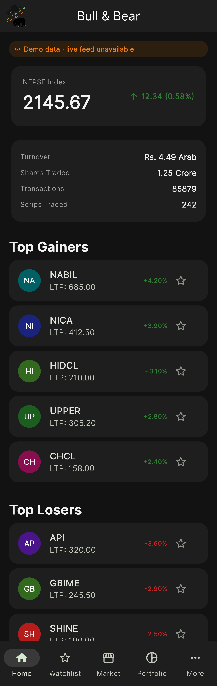
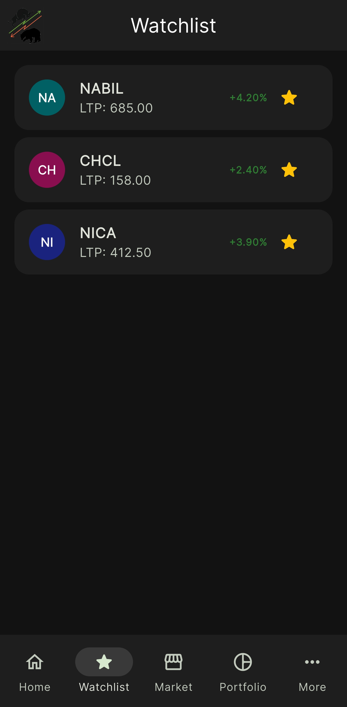
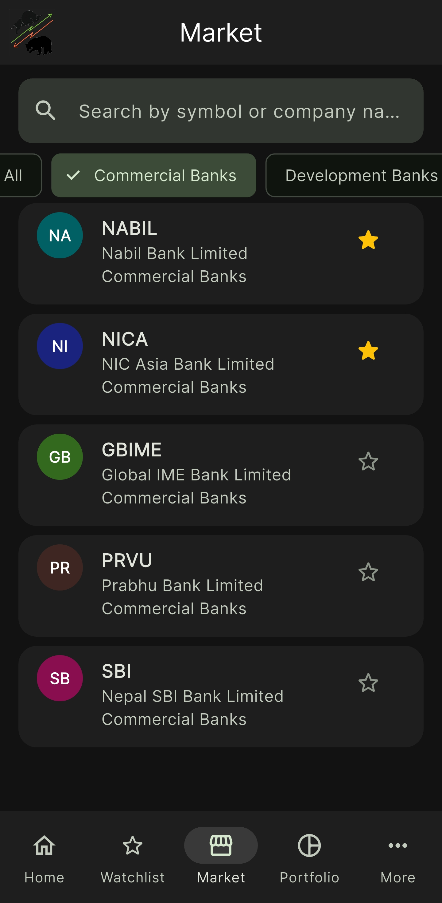
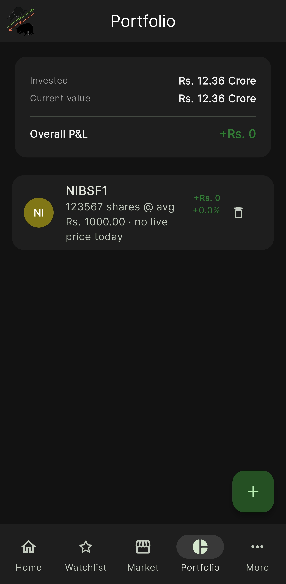
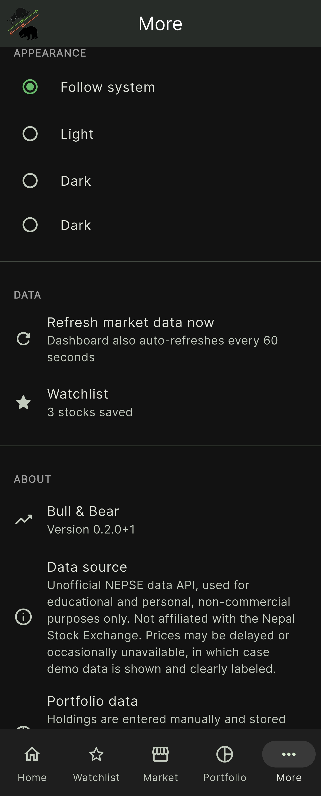
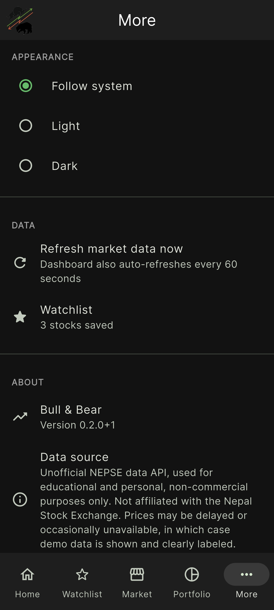

<h1 align="center">Bull & Bear</h1>

<h3 align="center">Nepal Stock Market (NEPSE), at a glance. 🐂📈🐻</h3>

---

## 📌 Project Overview

**Bull & Bear** is a Flutter mobile app that gives a quick, clean view of the
Nepal Stock Exchange (NEPSE) — the day's index movement, market summary,
top gainers/losers, a personal watchlist, a full searchable market list, and
a manually-tracked investment portfolio with live profit/loss.

It's a personal project built to learn and demonstrate a production-style
Flutter architecture (Riverpod + GoRouter + a repository-based data layer)
while solving a real, everyday problem: checking the Nepali stock market
without digging through a cluttered website.

> ⚠️ **Disclaimer:** Bull & Bear uses an **unofficial, third-party NEPSE data
> API** for educational and personal, non-commercial purposes only. It is
> **not affiliated with the Nepal Stock Exchange**. Prices may be delayed,
> and if the live feed is unavailable the app clearly labels the data shown
> as demo/preview data instead of presenting it as real-time. Portfolio
> holdings are entered manually by the user and stored locally on-device —
> Bull & Bear does not connect to any broker or bank account.

---

## 🔹 Key Features

- **Home Dashboard** — live NEPSE index value with point/percent change,
  market summary (total turnover, shares traded, transactions, scrips
  traded), and Top Gainers / Top Losers lists
- **Watchlist** — star any stock to track its live price and % change in one
  place
- **Market** — browse and search every listed company by symbol or name,
  filter by sector (e.g. Commercial Banks, Development Banks), and star
  stocks directly from the list
- **Portfolio** — manually log your holdings (symbol, shares, average cost)
  and see invested amount, current value, and overall profit/loss update
  against live prices
- **More**
  - **Appearance** — Follow System / Light / Dark theme switcher
  - **Data** — manual "refresh now" plus a periodic dashboard auto-refresh
  - **About** — in-app version info and transparent data-source /
    portfolio-data disclaimers
- **Graceful data fallback** — if the live NEPSE feed is unreachable, the
  dashboard clearly flags it with a "Demo data · live feed unavailable"
  banner instead of silently showing stale numbers as current
- Custom branded splash screen and app icon
- Bottom navigation: **Home · Watchlist · Market · Portfolio · More**

---

## 🚀 Technologies Used

- **Framework:** Flutter (Dart)
- **State Management:** [flutter_riverpod](https://pub.dev/packages/flutter_riverpod)
- **Navigation:** [go_router](https://pub.dev/packages/go_router)
- **Networking:** [dio](https://pub.dev/packages/dio)
- **Local Persistence:** [shared_preferences](https://pub.dev/packages/shared_preferences)
  (theme preference, watchlist, portfolio holdings)
- **Formatting:** [intl](https://pub.dev/packages/intl)
- **Typography:** [google_fonts](https://pub.dev/packages/google_fonts)
- **App Info:** [package_info_plus](https://pub.dev/packages/package_info_plus)
- **App Icon Generation:** [flutter_launcher_icons](https://pub.dev/packages/flutter_launcher_icons)
- **Data Source:** Unofficial NEPSE REST API

---

## 🏗️ Architecture

The app follows a **feature-first** structure: each screen lives in its own
folder under `lib/features/`, with its own `data/` (repositories/
controllers) and `model/` layer, while shared app-wide code (theming,
routing, the bottom-nav shell, API client) lives under `lib/core/`.

```
lib/
├── core/
│   ├── api/        # Shared Dio client
│   ├── router/      # GoRouter route definitions
│   ├── shell/        # Bottom-nav shell (Home · Watchlist · Market · Portfolio · More)
│   └── theme/        # Light/dark theming + persisted theme controller
├── features/
│   ├── splash/       # Branded splash screen
│   ├── dashboard/     # Home: NEPSE index, summary, gainers/losers
│   ├── watchlist/     # Starred stocks
│   ├── market/        # Searchable, filterable company list
│   ├── portfolio/     # Manual holdings + live P&L
│   └── more/          # Appearance, data, about/disclaimers
└── main.dart
```

Each feature talks to the network only through a repository, so the UI
layer never deals with raw JSON — and a mock/fallback repository keeps the
app usable (and clearly labeled as such) if the live API is down.

---

## 📱 Screenshots

| Splash Screen | Dashboard | Watchlist |
|:---:|:---:|:---:|
|  |  |  |

| Market | Portfolio |
|:---:|:---:|
|  |  |

| More — Appearance | More — About |
|:---:|:---:|
|  |  |   

---

## 🛠️ Installation & Setup

### 1️⃣ Prerequisites

- [Flutter SDK](https://docs.flutter.dev/get-started/install) `>=3.32.0`
- Dart SDK `>=3.8.0` (bundled with the Flutter SDK above)
- A connected device/emulator, or a configured Android/iOS toolchain

### 2️⃣ Clone the Repository

```bash
git clone https://github.com/ShakyaJU/bull-and-bear.git
cd bull-and-bear
```

### 3️⃣ Install Dependencies

```bash
flutter pub get
```

### 4️⃣ (Optional) Regenerate the App Icon

If you change the source art in `assets/icon/`, regenerate the platform
launcher icons with:

```bash
dart run flutter_launcher_icons
```

### 5️⃣ Run the App 🚀

```bash
flutter run
```

---

## 🎯 Potential Future Enhancements

- [ ] Price history charts / sparklines on the stock and index views
- [ ] Price alert notifications for watchlisted stocks
- [ ] Sector-level market analytics
- [ ] Export portfolio data

---

## ⭐ Like This Project?

If you find Bull & Bear useful, give the repo a ⭐ **Star** on GitHub!

---

<p align="center">Built by <a href="https://github.com/ShakyaJU">Justin Shakya</a></p>
